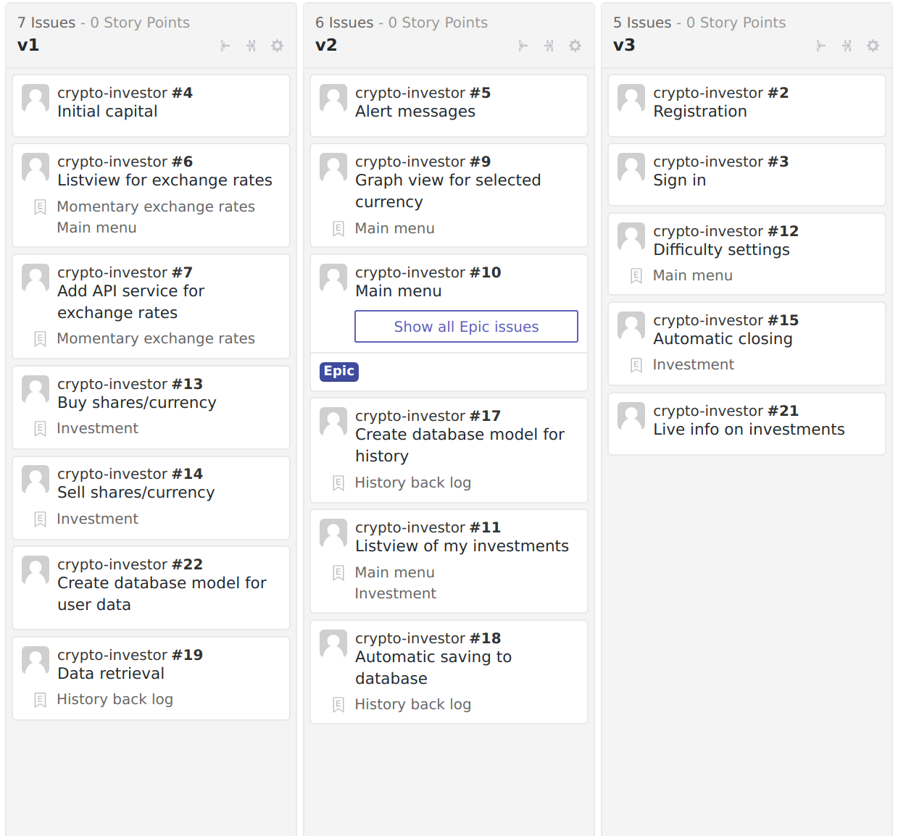

# Planovanie projektu

## Metafora

`Crypto-investor` je ako `Investičný terminál`

## Karticky

Tiez dostupne na [https://github.com/mskrip/crypto-investor#boards](https://github.com/mskrip/crypto-investor#boards)

| Registration                          |
| ------------------------------------- |
| Zakladna registracia pre pouzivatelov |
| 2 hod                                 |
| potesila by zakaznika                 |
| casovo viem priblizne odhadnut        |

| Sign in                               |
| ------------------------------------- |
| Zakladne prihlasenie pre pouzivatelov |
| 2 hod                                 |
| potesila by zakaznika                 |
| casovo viem priblizne odhadnut        |

| Initial capital                        |
| -------------------------------------- |
| Pridelenie kapitalu pri vytvoreni uctu |
| 1 hod                                  |
| nevyhnutna                             |
| casovo viem odhadnut                   |

| Alert messages                                          |
| ------------------------------------------------------- |
| Zobrazenie upozorneni o akciach nad kapitalom a celkovo |
| 1.5 hod                                                 |
| potesila by zakaznika                                   |
| casovo neviem odhadnut                                  |

| Listview for exchange rates                                        |
| ------------------------------------------------------------------ |
| Vytvorenie miesta pre zobrazenie jednotlivych kurzov a ich pohybov |
| 2 hod                                                              |
| nevyhnutna                                                         |
| casovo viem priblizne odhadnut                                     |

| Add API service for exchange rates                 |
| -------------------------------------------------- |
| Tahanie dat pre listview a databazu z nejakeho API |
| 2 hod                                              |
| nevyhnutna                                         |
| casovo viem priblizne odhadnut                     |

| Graph view for selected currency |
| -------------------------------- |
| Zobrazenie pohybov meny v grafe  |
| 2 hod                            |
| velmi uzitocna                   |
| casovo viem priblizne odhadnut   |

| Listview of investments                   |
| ----------------------------------------- |
| Zobrazenie investicii pouzivatela v liste |
| 2 hod                                     |
| nevyhnutna                                |
| casovo viem priblizne odhadnut            |

| Difficulty settings        |
| -------------------------- |
| Zmena zlozitosti simulacie |
| 2 hod                      |
| potesila by zakaznika      |
| casovo neviem odhadnut     |

| Buy shares/currency            |
| ------------------------------ |
| Kupit podiely                  |
| 1.5 hod                        |
| nevyhnutna                     |
| casovo viem priblizne odhadnut |

| Sell shares/currency |
| -------------------- |
| Predat podiely       |
| 0.5 hod              |
| nevyhnutna           |
| casovo viem odhadnut |

| Automatic closing                                                                                         |
| --------------------------------------------------------------------------------------------------------- |
| Automaticke uzatvaranie investicii pri extremoch (priliz klesne/zarobi dost) a nastavovanie tychto hranic |
| 2 hod                                                                                                     |
| potesila by zakaznika                                                                                     |
| casovo neviem odhadnut                                                                                    |

| Create database model for history               |
| ----------------------------------------------- |
| Vytvorit model databazy pre historiu investicii |
| 1 hod                                           |
| velmi dolezita                                  |
| casovo viem priblizne odhadnut                  |

| Create database model for user data                     |
| ------------------------------------------------------- |
| Vytvorit model databazy pre momentalne data pouzivatela |
| 1 hod                                                   |
| nevyhnutna                                              |
| casovo viem priblizne odhadnut                          |

| Automatic saving to database   |
| ------------------------------ |
| Ukladanie dat do databazy      |
| 1 hod                          |
| nevyhnutna                     |
| casovo viem priblizne odhadnut |

| Data retrieval            |
| ------------------------- |
| Ziskavanie dat z databazy |
| 1 hod                     |
| nevyhnutna                |
| casovo viem odhnadnut     |

| Live info on investments                         |
| ------------------------------------------------ |
| Sumarne zobrazenie momentalneho kapitalu a zisku |
| 2 hod                                            |
| velmi dolezita                                   |
| casovo viem odhadnut                             |

## Verzie

[https://github.com/mskrip/crypto-investor#boards](https://github.com/mskrip/crypto-investor#boards)
